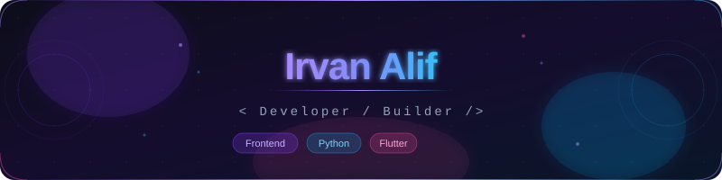

<!-- Upload banner.svg ke repo kamu, lalu link seperti ini -->

 

 

---

<h2>💻 Tech Stack</h2>

---

<h2>📊 GitHub Stats</h2>

  
  &nbsp;
  

  

---

<h2>🏆 GitHub Trophies</h2>

  

---

<h2>✍️ Dev Quote</h2>

  

---

